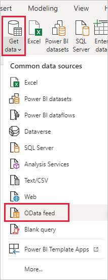
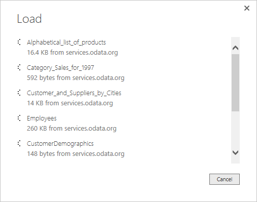

---
lab:
    title: 'Connect to OData feeds'
    module: 'Module 14 - Connect to OData feeds'
---

#### Lab: Connect to OData feeds

In Power BI Desktop, you can connect to an **OData feed** and use the
underlying data just like any other data source in Power BI Desktop.

To connect to an OData feed, select **Get data \> OData feed** from the
**Home** ribbon in Power BI Desktop.

In the **OData Feed** window that appears, type or paste your OData feed
URL into the box, and select **OK**.

The location of the Northwind OData feed changes occasionally. Currently
the link is <https://services.odata.org/v2/northwind/northwind.svc/>.

Power BI Desktop connects to the OData feed, and displays the available
tables and other data elements in the **Navigator** window. When you
select an element, the right pane of the **Navigator** window displays a
preview of the data. You can select as many tables as you want to
import. The **Navigator** window shows a preview of the currently
selected table.

You can choose the **Transform Data** button, which launches **Power
Query Editor**, where you can shape and transform the data from the
OData feed before importing it into Power BI Desktop. Or you can select
the **Load** button, and import all of the data elements you selected in
the left pane.

When we select **Load**, Power BI Desktop imports the selected items,
and displays a **Load** window of the import progress.

Once complete, Power BI Desktop makes the selected tables and other data
elements available in the **Data** pane, found on the right side of
the *Reports* view in Power BI Desktop.

And that's it!

You're now ready to use the imported data from the OData feed in Power
BI Desktop to create visuals, reports, or interact with any other data
you might want to connect with and import, such as other Excel
workbooks, databases, or any other data source.

